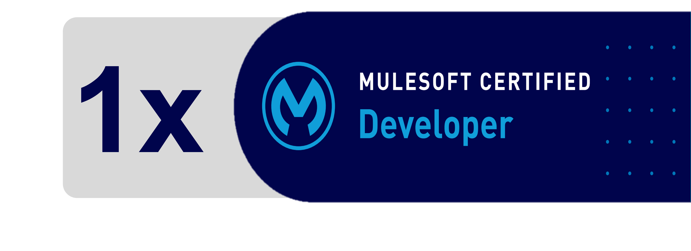

<h1 align='center'> Hi! :wave:</h1>

    
    
        <h3>I'm Narender Singh, a.k.a ForcePanda</h3>
      
    3x Salesforce MVP, International Speaker, Salesforce Developer-Architect, Flow Advocate & Trainer, Certified Mulesoft Dev, Blogger @ ForcePanda, Salesforce Berlin Group 

    <a href="https://twitter.com/Nads_P07">Twitter</a> •
    <a href="https://www.linkedin.com/in/narendersingh07/">LinkedIn</a> •
    <a href="https://trailblazer.me/id/nads07">Trailhead</a> •
    <a href="https://forcepanda.wordpress.com/">Website(ForcePanda)</a>

 
<h2> I work on </h2>
 

    &emsp;&emsp;&emsp;&emsp;
    &emsp;&emsp;&emsp;
    &emsp;&emsp;&emsp;
    

 

<h3>Certifications</h3>

    &emsp;&emsp;&emsp;&emsp;
    

 

<!-- Visitors Counter -->

    

